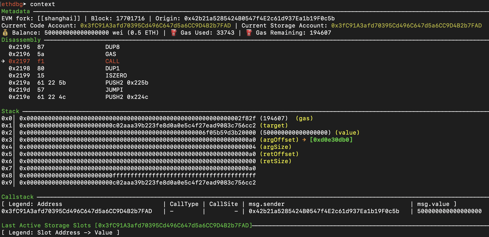

Print the current context of the EVM.

Syntax: `context`

The context is divided in different views that provide different kind of information during debugging.

### 👀 Source View
This view is displayed when the account currently executing has source code available.
To provide source code an user can drop a `.json` file in the registry (`~/.config/ethpwn/pwn/registry`) as explained in NEED_LINK_HERE, or, one can add an ETHERSCAN API KEY, set it in the config file at `~/.config/ethpwn/config.json` and `ethdbg` will automatically try to fetch the contract code.

This view hihlights the currently executing source code line corresponding to the EVM opcodes displayed in the Disassembly view.

This view can be disabled by using the option ` "hide_source_view": true` in the config file (`~/.config/ethpwn/config.json`).

### 👀 Metadata View
The Metadata view is showing different kind of useful information regarding the currently executing transaction.

| Field                 | What |
|-------------------|----------|
| `Fork`   | Version of the EVM currently executing |
| `Block`  | Block number at which the current transaction is executing
| `Origin` | The account that started the transaction|
| `Current code account` | The address of the smart contract currently executing code
| `Current storage account` | The address of the smart contract whose storage will be referenced during an SSTORE/SLOAD
| `Balance`           | The balance of the Current code account
| `Gas Used`          | The amount of gas used up until the current opcode
| `Gas Remaining`    | How much gas is remaining for this transaction execution

### 👀 Disassembly View
Here we display the currently executing opcode, a small history of opcodes executed up to this point, and a short look-ahead of the following opcodes.

(You can see the full history by using the command `log_op`).

### 👀 Stack View
A view of the currently active EVM stack.

### 👀 Callstack View

The Callstack View provides insight regarding the nested calls that are performed by a transactions to different contracts during execution (i.e., internal transactions created by these opcodes: `CALL`, `DELEGATECALL`, `STATICCALL`, `CODECALL`, `CREATE`, `CREATE2`).
This view provides the following information:

| Field                 | What |
|-------------------|----------|
| `Address`    | The current code address executing (the target of the last-issued `CALL`/...) |
| `Call Type`  | Type of call, `CALL`, `DELEGATECALL`, `STATICCALL`, `CODECALL`, `CREATE`, `CREATE2`
| `Call Site`  | The program counter value in the caller contract when the last-call was issued
| `msg.sender` | The value of the `msg.sender` in this call-context
| `msg.value`  | The amount of ETH sent by the caller for this call-context
| `Name`       | If the contract is in the [registry](), we display its name here.